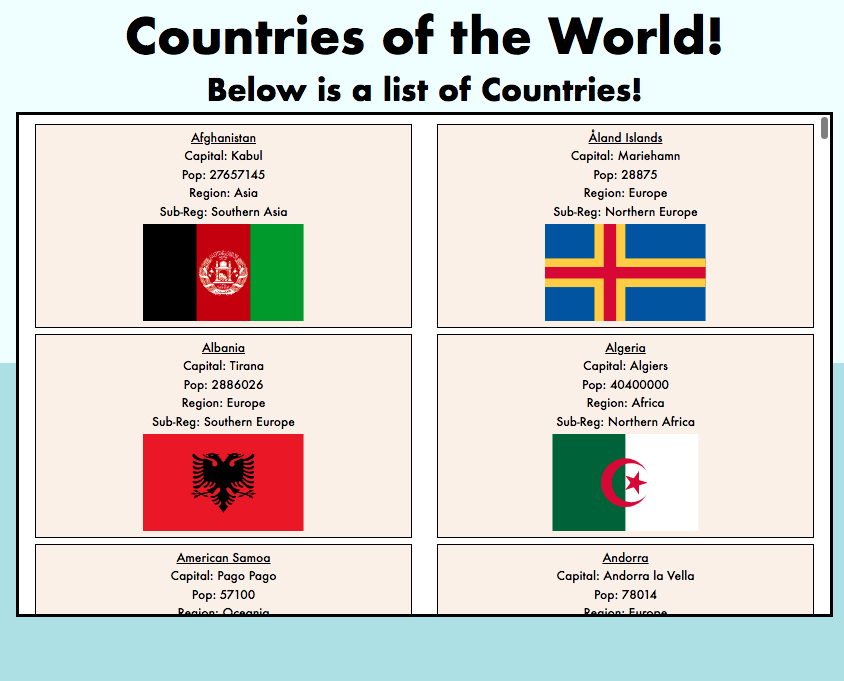
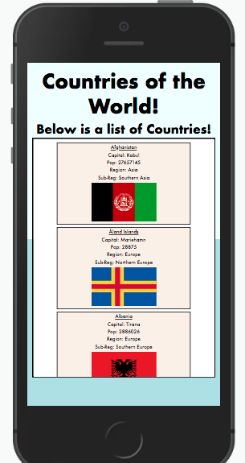

# Countries of the World.

This is a simple web-application that displays the countries of the world; sourced from an API.

## Build with:
* JavaScript
* CSS
* HTML
---
## App Image: In-use Image.

---
## App Image: Responsive Example.

